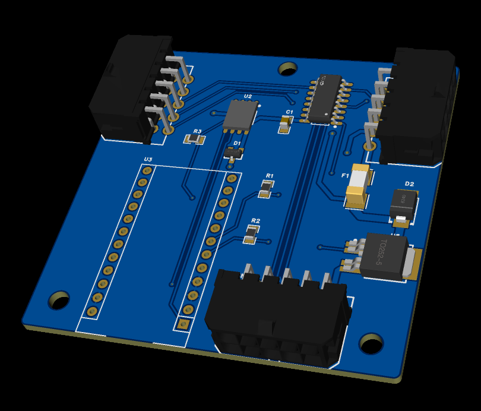
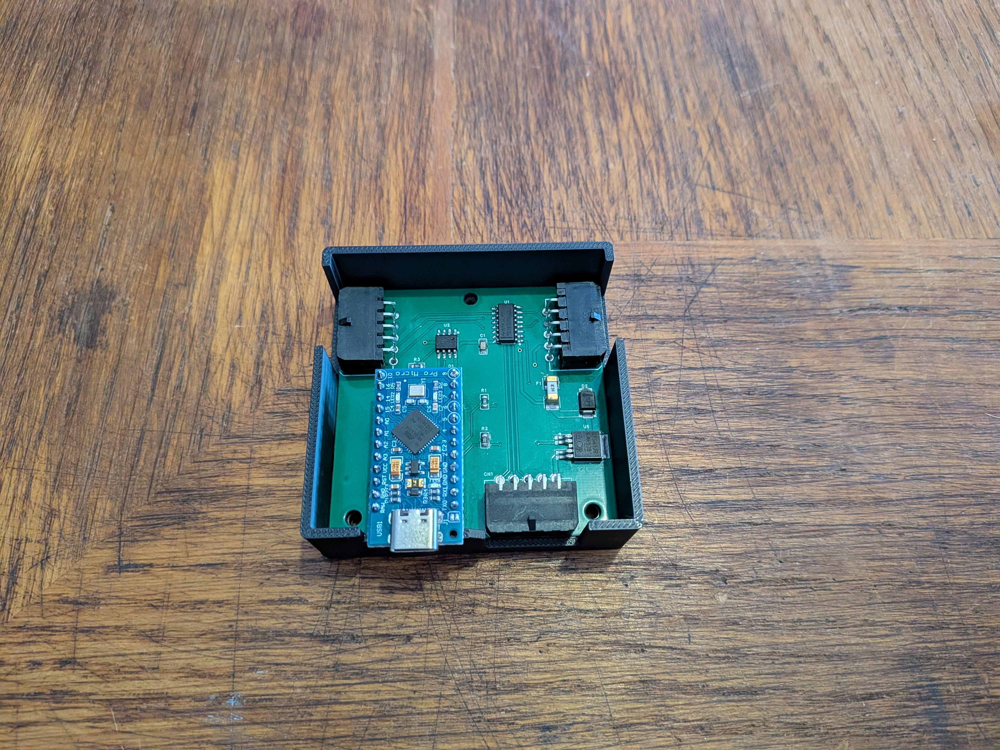
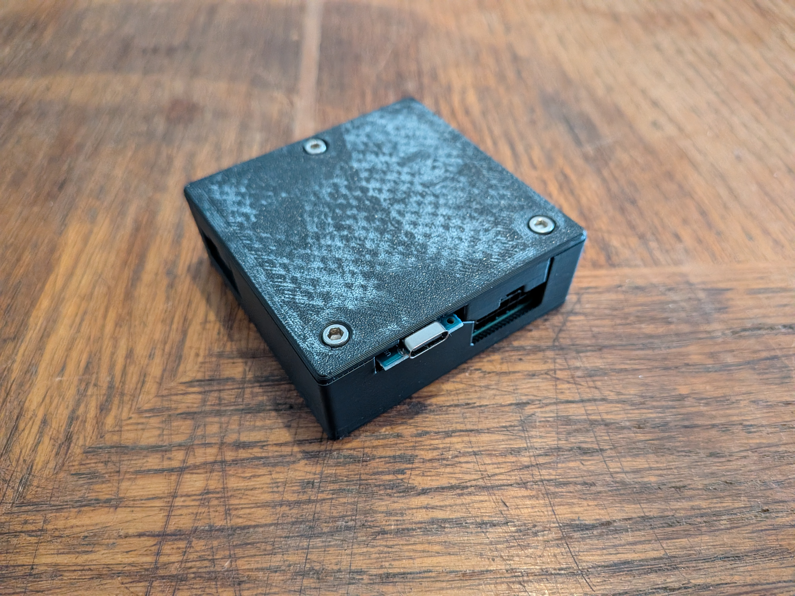
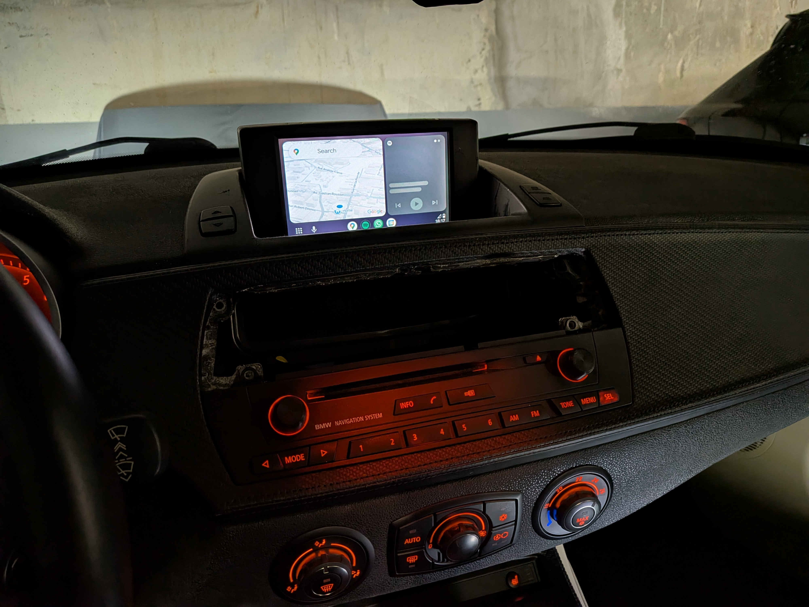

# RGsB Switcher fopr IBUS BMW E series

This PCB is meant to be used with this RPI Hat https://github.com/ZouhirYachou/RPI5_RGsB_HAT 

  

## Purpose / Features
- Reads IBUS messages and power on the Arduino when IBUS activity is dectected (When the car is open)
- Only sends power to the RPI when IGN POS2 is dectected (Same as original Radio/NAV)
- When RPI input is selected, with the "PHONE" button, some radio buttons are used to control the Carplay / Android Auto on the RPI
- Radio buttons that changes the display of the original NAV, sends you back to default display (RPI input is OFF)
- Only reads IBUS, does not sends messages
- Not modification required to the original system as it is installed between the NAV and the CID (NAV Display)
  

## Repository contents
- `hardware` Schematic, Gerber, BOM, Pick and place for PCB fabrication
- `STLs` 3d files to print your own case for this hat
- `Arduino` Arduino code to flash into the Arduino Pro Micro

## Getting started
1. Flash the Arduino 
2. Install the assembled PCB with the Arduino into the car
3. Connect a USB cable between the Arduino and the RPI to send the keyboard strokes to the RPI
3. Press the "PHONE" button after car is strated or IGN in position 2
4. Carplay / Android Auto should show if you installed this solution https://github.com/f-io/LIVI

## 3D Printed Case
Provided STLs should be printed either with ABS or ASA 
It requires the following fasteners:
| Fasteners     | Quantity |
| ------------- |:-------------:|
| M3*20mm      | 3    |

  

  

## Safety / Warnings
- Tested inside the car for few hours while driving, nothing blew up, yes, but the design can be improved to be more resilient to car electric systems.

## Todo list
- Improve the design with integrated MCU
- Single board with RPI CM5 

## Images

Once installed

  

## Contributing
- Any improvements on the design are welcome.

## References
- https://www.e46fanatics.com/threads/bmw-on-board-monitor-without-navigation-unit.1303552
- https://github.com/f-io/LIVI